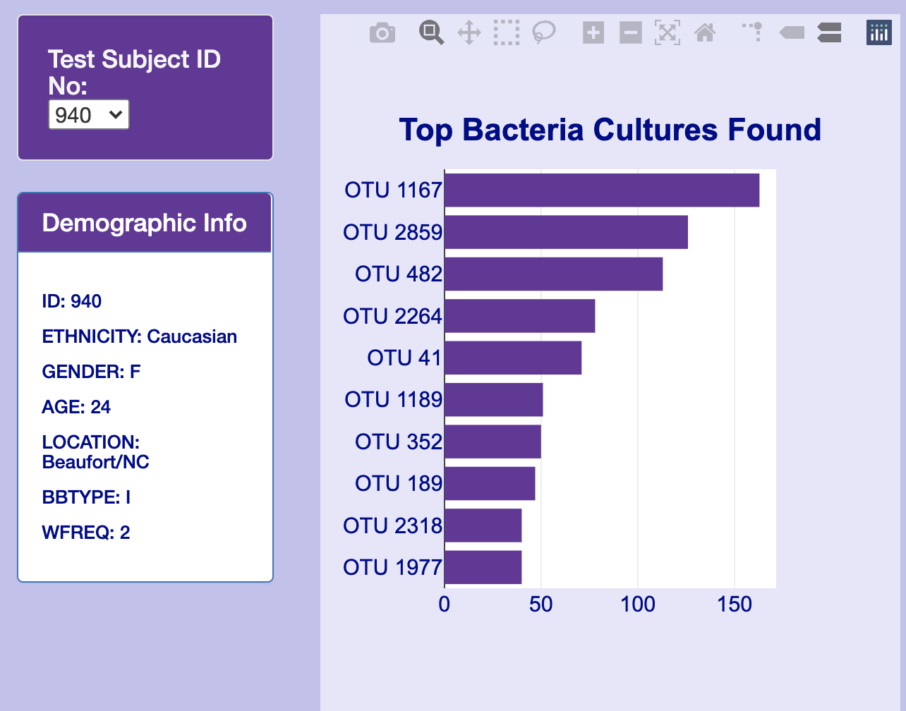
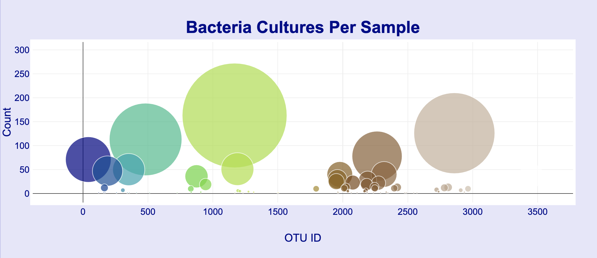

# Belly_button_biodiversity

Belly button Analysis

## Overview of Analysis:

"*Improbable Beef*" Beef from Belly Button bacteria.The purpose of this research group is to discover bacterial species in the belly button that synthesize protein that tastes like beef. 

### Purpose of this study:

The purpose of this study is to create a website with full information where the volunteers of this study will be able to identify the top 10 bacterial species present in their belly buttons. 

### Horizontal Bar graph:

A horizontal bar graph with hover text was created with the top 10 bacterial data along with their OTU ID's.

### Bubble graph:

A bubble graph with hover text was created including all the bacterial species that are present in the volunteer's belly button.

### Gauge map:

A Gauge Chart is created with taking the washing frequency from the metadata where the bar of the gauge marks the number of washing frequencies.

